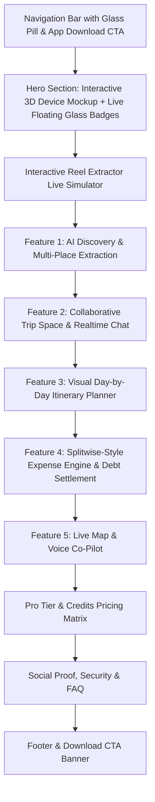

# Locra AI — Master Website Blueprint & App Context

This document provides complete, end-to-end context for **Locra AI** (the collaborative AI-powered travel mobile app) and establishes the complete architectural, UI/UX, and visual design blueprint for building the **Locra AI Website** in `~/Developer/fullstack-dev/locra_app`.

---

## 1. Product Overview & Core Value Proposition

**Locra AI** is a collaborative, AI-native group travel planning application built with React Native (Expo) and Supabase. It solves the fragmented travel planning experience by consolidating five essential travel tools into a single, cohesive, glassmorphic interface:

| Traditional Tool | Replaced By Locra AI Feature | Locra AI Superpower |
|---|---|---|
| **Instagram / TikTok Saved Audio/Reels** | **AI Reel & Video Place Extractor** | Paste any Reel/TikTok URL $\to$ OCR, speech, vision, and metadata extract verified Google Places with coordinates. |
| **Notion / Google Docs** | **Collaborative Timeline Itinerary** | Realtime drag-and-drop daily schedule with travel times and map sync. |
| **Splitwise / Tricount** | **Built-in Expense Engine** | Multi-currency equal/percentage/custom splits, auto debt minimization, and settlement matrix. |
| **WhatsApp / Telegram Travel Groups** | **Realtime Trip Space & Chat** | Dedicated trip channel with place cards, expense mentions, and live status. |
| **Google Maps Saved Lists** | **Interactive Dark Travel Map** | Live friend location sharing, offline map pack downloads, and canonical place verification. |
| **Manual Search / Notes** | **Hands-free Voice AI Assistant** | Realtime voice intent recognition for adding spots, tracking expenses, and itinerary queries. |

---

## 2. Complete App Architecture & Feature Deep-Dive

### 2.1 AI Reel Extractor Pipeline
- **Input**: Instagram Reel URLs, TikTok links, video URLs, travel screenshots, text captions.
- **Processing**: Universal extraction endpoint `/api/v1/extract/universal` (and async job queue `/api/v1/extract/async`).
- **Intelligence**:
  - Instagram metadata & caption analysis
  - Vision & OCR for on-screen text detection
  - Speech-to-text audio transcription
  - Google Places API canonical validation (place ID, address, lat/lng)
  - Confidence scoring (High confidence = **Verified Badge** $\ge 85\%$, Low confidence = Needs review)
- **Multi-Place Handling**: 1 Reel $\to$ Multiple distinct places (e.g., Waterfall $\to$ Cafe $\to$ Viewpoint $\to$ Resort).
- **Duplicate Prevention**: Matched via canonical Google `place_id` or `(name, lat, lng)` proximity.

### 2.2 Trip Spaces & Collaboration
- **Trips**: Title, destination, start/end dates, cover image, invite code, invite link (`locra://trip/{id}`).
- **Roles**: Trip Owner & Members.
- **Activity Feed**: Real-time event log ("Altaf added Barki Waterfall", "Ahmed joined the trip", "John logged ₹3,000 for dinner").
- **Live Location Sharing**: Realtime friend tracker on the map with battery-friendly throttling.

### 2.3 Interactive Day-by-Day Visual Itinerary
- **Structure**: Itinerary Days $\to$ Itinerary Items (place reference, start/end time, notes, order index).
- **Views**: Timeline view, Day Selector chips, Map view overlay with route pins.
- **Actions**: Add from saved places, manual entry, reorder, visit status toggle (To Visit, Visited, Skipped).

### 2.4 Smart Expense & Debt Minimization System
- **Expense Entry**: Title, amount, currency, category (Food, Transport, Hotel, Activities, Shopping, Fuel, Tickets, Other), payer, split type.
- **Split Modes**:
  1. Equal split among all/selected members
  2. Exact custom amounts
  3. Percentage shares
- **Settlement Matrix**: Calculates net balances and generates minimum necessary cash transfers between members.

### 2.5 Voice AI Co-Pilot
- Native voice recognition with intent extraction (e.g. *"Add a coffee break at Blue Tokai at 4 PM"*, *"Split ₹1500 taxi with Ahmed"*).

### 2.6 Pro Tier & AI Credits
- **RevenueCat** subscription sync with monthly AI credits for heavy reel extractions, offline map downloads, and premium itinerary exports.

---

## 3. Dark Glassmorphism Design System

The website design strictly mirrors the ultra-sleek, premium mobile app theme:

### 3.1 Color Palette
```css
:root {
  /* Backgrounds */
  --bg-primary: #070709;
  --bg-secondary: #0E0E14;
  --bg-tertiary: #161620;

  /* Typography */
  --text-primary: #FFFFFF;
  --text-secondary: rgba(255, 255, 255, 0.70);
  --text-tertiary: rgba(255, 255, 255, 0.42);
  --text-disabled: rgba(255, 255, 255, 0.22);

  /* Brand Accents */
  --accent-amber: #FF8A3D;
  --accent-amber-glow: rgba(255, 138, 61, 0.18);
  --brand-gold: #FFB000;
  --brand-cyan: #38BDF8;
  --brand-purple: #A855F7;

  /* Status Colors */
  --success-emerald: #10B981; /* Verified Badge */
  --warning-amber: #F59E0B;
  --danger-rose: #EF4444;

  /* Glass Tokens */
  --glass-surface: rgba(18, 18, 24, 0.72);
  --glass-surface-strong: rgba(24, 24, 32, 0.88);
  --glass-fill: rgba(255, 255, 255, 0.04);
  --glass-border: rgba(255, 255, 255, 0.08);
  --glass-border-light: rgba(255, 255, 255, 0.14);
  --glass-border-accent: rgba(255, 138, 61, 0.35);
  
  /* Gradients */
  --gradient-accent: linear-gradient(135deg, #FF9843 0%, #FF8A3D 100%);
  --gradient-cyan: linear-gradient(135deg, #38BDF8 0%, #0284C7 100%);
  --gradient-dark: linear-gradient(180deg, #070709 0%, #0E0E14 100%);
}
```

### 3.2 Glass Card CSS Recipe
```css
.glass-panel {
  background: rgba(18, 18, 24, 0.75);
  backdrop-filter: blur(24px) saturate(180%);
  -webkit-backdrop-filter: blur(24px) saturate(180%);
  border: 1px solid rgba(255, 255, 255, 0.09);
  box-shadow: 0 20px 50px rgba(0, 0, 0, 0.5), inset 0 1px 0 rgba(255, 255, 255, 0.1);
  border-radius: 24px;
}
```

---

## 4. Website Layout & Showcase Strategy

The website in `locra_app` is structured as a high-converting, interactive product showcase:



### 4.1 Section Breakdown

1. **Floating Glass Header**:
   - Brand logo with glowing amber gradient.
   - Quick navigation (Features, How It Works, Pricing, FAQ, Blog).
   - "Download App" CTA with glowing backdrop blur.

2. **Hero Showcase Section**:
   - **Headline**: *"Turn Instagram Reels into Real Trips in Seconds."*
   - **Subhead**: *"The collaborative, AI-native travel planner that extracts verified places from reels, builds day-by-day itineraries, and splits group expenses effortlessly."*
   - **Interactive 3D Device Mockup**: Centered iPhone/Android frame displaying the real Locra AI app UI with animated floating glass badges:
     - 🌟 *Verified Place Card (Barki Waterfall, 98% Confidence)*
     - 💸 *Expense Split (₹3,000 Dinner $\to$ ₹1,000 each)*
     - 📍 *Live Friend Marker (Altaf • Active Now)*
     - 🎙️ *Voice AI Waveform ("Added cafe to Day 2")*

3. **Interactive "Try Reel Extractor" Demo**:
   - An interactive widget where website visitors can paste an Instagram Reel URL or click one of 3 demo presets (e.g. *Goa Hidden Cafes*, *Chikkamagaluru Waterfalls*, *Manali Trek*).
   - Shows simulated real-time AI scanning (OCR $\to$ Speech $\to$ Google Places verification) and displays the extracted place cards.

4. **Bento Grid of Core Capabilities**:
   - **Card 1 (Large)**: Multi-Place Extraction with confidence badges & source reel attribution.
   - **Card 2**: Group Chat with shared place cards and expense notifications.
   - **Card 3**: Drag-and-drop Visual Itinerary with route times.
   - **Card 4**: Auto-Settlement Expense Graph.
   - **Card 5**: Offline Map Packs & Battery-Optimized Live Location.

5. **Voice AI Interactive Waveform Banner**:
   - Audio pulse animation demonstrating hands-free voice commands.

6. **Pricing & AI Credits**:
   - Free Tier vs. Locra Pro (Monthly AI extractions, offline maps, premium PDF itinerary export).

---

## 5. ADB App Screenshot & Asset Capture Workflow

To capture real screenshots from the running Android emulator (`emulator-5554`) or connected device:

### 5.1 ADB Automated Screenshot Script
```bash
# 1. Ensure emulator is active
adb devices

# 2. Capture specific screen to device /sdcard/
adb shell screencap -p /sdcard/screen_home.png
adb shell screencap -p /sdcard/screen_extractor.png
adb shell screencap -p /sdcard/screen_itinerary.png
adb shell screencap -p /sdcard/screen_expenses.png
adb shell screencap -p /sdcard/screen_chat.png

# 3. Pull screenshots directly into website assets directory
mkdir -p ~/Developer/fullstack-dev/locra_app/public/screenshots
adb pull /sdcard/screen_home.png ~/Developer/fullstack-dev/locra_app/public/screenshots/
adb pull /sdcard/screen_extractor.png ~/Developer/fullstack-dev/locra_app/public/screenshots/
adb pull /sdcard/screen_itinerary.png ~/Developer/fullstack-dev/locra_app/public/screenshots/
adb pull /sdcard/screen_expenses.png ~/Developer/fullstack-dev/locra_app/public/screenshots/
adb pull /sdcard/screen_chat.png ~/Developer/fullstack-dev/locra_app/public/screenshots/

# 4. Clean up temporary device storage
adb shell rm /sdcard/screen_*.png
```

### 5.2 Video Demo Capture via ADB
```bash
# Record 15-second MP4 demo of Reel Extraction or Itinerary
adb shell screenrecord --size 1080x2400 --time-limit 15 /sdcard/demo_reel.mp4
adb pull /sdcard/demo_reel.mp4 ~/Developer/fullstack-dev/locra_app/public/videos/
adb shell rm /sdcard/demo_reel.mp4
```

---

## 6. Verification & Implementation Checklist

- [x] Full App context extracted from `locra-AI` (features, database schema, services, design tokens).
- [x] Glassmorphism design tokens and styling guidelines defined.
- [x] Website layout, interactive demos, and component hierarchy planned.
- [x] ADB screenshot and video capture workflow documented.
- [x] Complete plan saved to `~/Developer/fullstack-dev/locra_app/WEBSITE_CONTEXT_AND_DESIGN_PLAN.md`.
